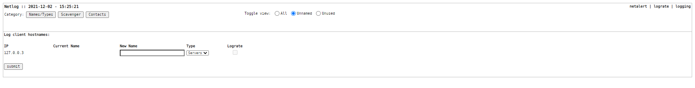
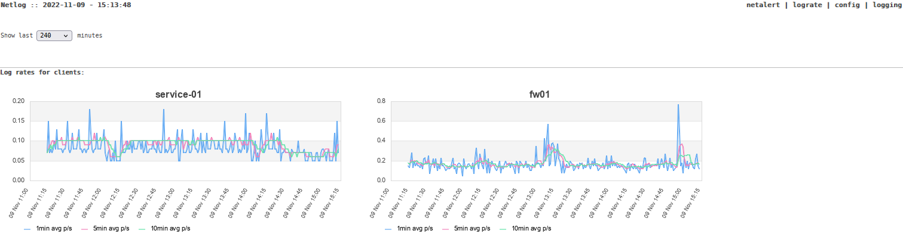

# Netlog
A Syslog-NG to MySQL parser with no-nonsense frontend

   

Current development work: reworking from php <5.6-style to modern php, better SQL (prepared) queries, efficiency, code readability, css and code styling, adjustability (more settings to DB), etc. 

Current open items:
- email/contacts
- directory structure
- deployment/installation
- documentation

### Requirements

- Syslog-NG 3.3 or newer
- PHP 7.4 or newer
- MySQL 8.0 or equivalent (like MariaDB 10.x)

_Build and tested on Centos7.9, Apache 2.4 PHP 7.4 (Remi), MariaDB 10.6_

### External software

- TrueType fonts
- JPGraph 4.3.5 (https://jpgraph.net/)

### Features

Netlog has a few key-features
- stupidly easy navigation through log entries per host
- configurable hostnames
- Lograte graphing for trend analysis and fast detecting of events
- Logscavenger for early detections of issues, specific events
- netalert dashboard page with easy coloring of new items from Logscavenger
- archiving day-to-day tables in monthly tables after (default) 14 days

And of course, most settings are present in the 'global' netlog config database table, so some customisation can be made.
The hostname table can be modified with ease to keep it in sync with your NMS (e.g. LibreNMS) as this is an simple task between the 2 databases.

### The gui

