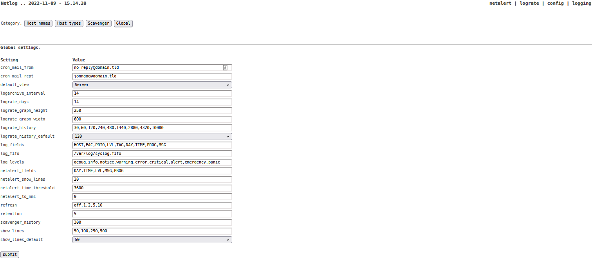

# Netlog
A Syslog-NG to MySQL parser with no-nonsense frontend

   

Development work in branch dev_v3.0: reworking from php <5.4-style to modern php, better SQL (prepared) queries, efficiency, code readability, css and code styling, adjustability (more settings to DB), etc. 

Current open items for testing:
- hardening, security, exceptions/error handling could be improved

### Requirements

- Syslog-NG 3.3 or newer
- PHP 7.4 or newer, prefered 8.0/8.1
- MySQL 8.0 or equivalent (like MariaDB 10.x)

_Build, developped and tested on Centos7.9, Syslog-NG 3.36, Apache 2.4 PHP 7.4 and 8.0/8.1, MariaDB 10.6_

### External software

- TrueType (msttcore) fonts
- JpGraph 4.4.1 (https://jpgraph.net/)

### Features

Netlog has a few key-features
- stupidly easy navigation through log entries per host
- configurable hostnames and groups
- Lograte graphing for trend analysis and fast detecting of events
- Logscavenger for early detections of issues, specific events
- Netalert dashboard page with easy coloring of new events from Logscavenger
- archiving day-to-day tables in monthly tables after (default) 14 days
- log2nms to send the Netalert events to your NMS

And of course, most settings are present in the 'global' netlog config database table, so some customisation can be made.
The hostname table can be modified with ease to keep it in sync with your NMS (e.g. LibreNMS) as this is a simple task between the 2 databases.

### The gui

---

---

---

