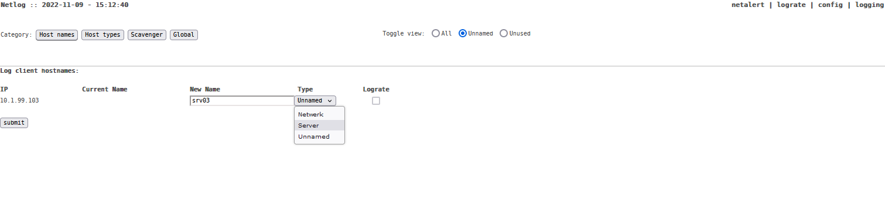

# Netlog
A Syslog-NG to MySQL parser with no-nonsense frontend

  

### Requirements

- Apache httpd 2.4
- Syslog-NG 3.3 or newer
- PHP 8.1/8.2/8.3
- MariaDB 10.x, MySQL 8.0 or equivalent

_Build, developped and tested on Centos7.9, Ubuntu20/22/24, AlmaLinux 8/9, Syslog-NG 3.3x, Apache 2.4, 8.0/8.1/8.2/8.3, MariaDB 10.x_

### External software
Provided within this repository

- TrueType (msttcore) fonts
- JpGraph 4.4.2 (https://jpgraph.net/)

### Features

Netlog has a few key-features
- stupidly easy navigation through log entries per host
- configurable hostnames and groups
- Lograte graphing for trend analysis and fast detecting of events
- Logscavenger for early detections of issues, specific events
- Netalert dashboard page with easy coloring of new events from Logscavenger
- archiving day-to-day tables in monthly tables after 14 (default) days
- log2nms to send the Netalert events to your LibreNMS

And of course, most settings are present in the 'global' netlog config database table, so some customisation can be made.
The hostname table can be modified with ease to keep it in sync with your NMS (e.g. LibreNMS) as this is a simple task between the 2 databases.

### Real life examples

The Netlog system is currently running on different environments. Not all are tracked. What can it do? Here are 2 examples.

Example 1:
- 150+ active hosts logging per day, running between 26-30M lines total per day.
- On a 2 vCPU (Xeon Gold 6240) CentOS 7.9 machine, with 8GB memory
- 2 disks, 16GB OS, 600GB data disk for MySQL, both on SSD storage
- Syslog-ng 3.34, PHP8.2, MariaDB 10.6, Apache 2.4
- Running approx. 20% CPU usage, load average <1
- Batched setting 1s/1000lines, retention 3 months
- MySQL tweaked with MySQLTuner

Example 2:
- 15+ active hosts logging per day, running between 35-45M lines total per day.
- On a 2 vCPU (Xeon Gold 6248) Ubuntu 22.04 LTS machine, with 8GB memory
- 2 disks, 60GB OS, 300G data disk for MySQL, both on SSD storage
- Syslog-ng 3.35, PHP8.3, MariaDB 10.6, Apache 2.4
- Running approx. 15% CPU usage, load average <1
- Batched setting 1s/1000lines, retention 2 months

### Install

See [Installation](docs/installation.md) for more details about installation on different distributions. 
Or, if in a real hurry (with a LAMP-stack):

```shell
sudo git clone https://github.com/barreljan/netlog/ /usr/local/src/netlog
sudo bash /usr/local/src/netlog/install/install.sh
```

### The gui


---


---


---

